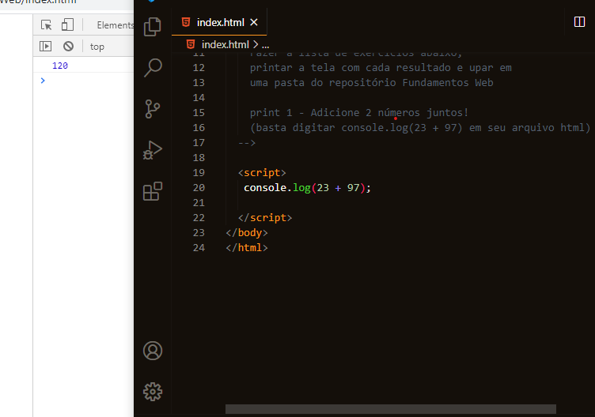
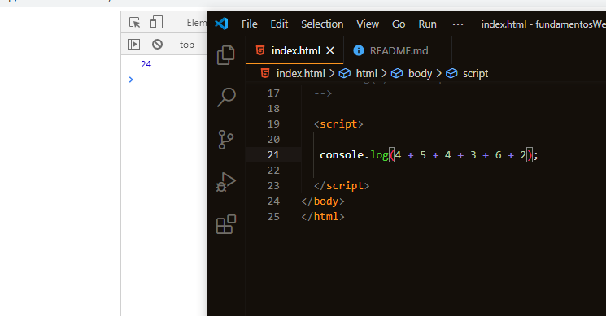
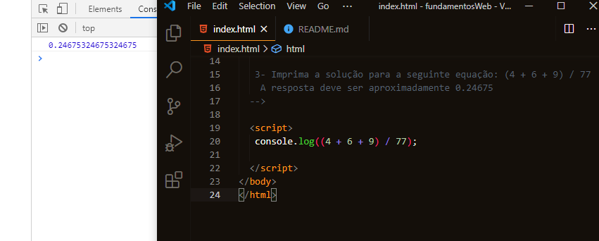
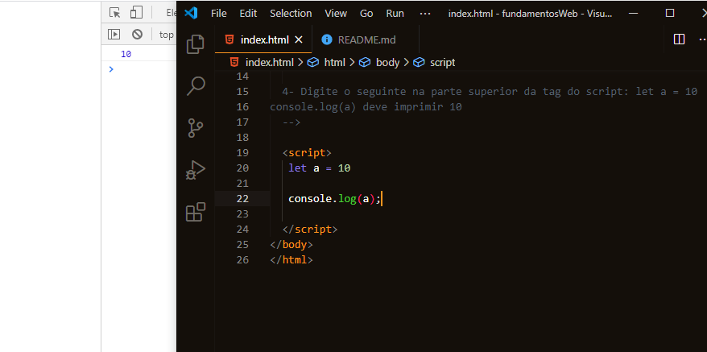
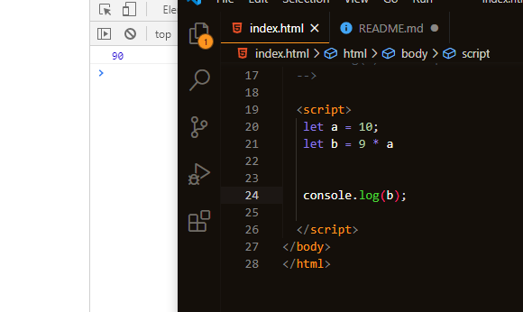
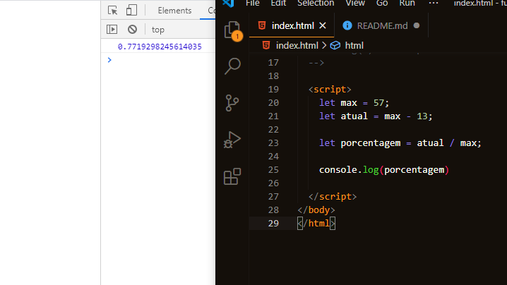

<h1>:star: Fundamentos Web (parte 1 e 2) Gabriel e Érika :star:</h1>

1 - Adicione 2 números juntos! (basta digitar console.log(23 + 97) em seu arquivo html)

2- Adicione uma sequência de 6 números diferentes juntos.

3- Imprima a solução para a seguinte equação: (4 + 6 + 9) / 77
A resposta deve ser aproximadamente 0.24675

4- Digite o seguinte na parte superior da tag do script: let a = 10
console.log(a) deve imprimir 10

5- Experimente o seguinte: 9 * a
e este: let b = 7 * a(retorna indefinido) e entãoconsole.log(b)

Sequência: Declarar variaveis, e definir o percentual dos valores

